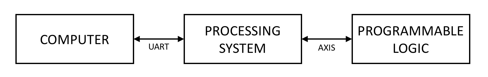

# Hardware Neural Network

Hardware accelerator of a Multilayer Perceptron running on a Xilinx Zynq-7000 SoC.

	

## Scope

## Overview

## Implementations

### Standalone vectorized software

### Embedded software

### Standalone integer Matlab code

### Embedded hardware

#### Block RAM

#### Distributed RAM

### About the final app

## Current issues

## What comes next

## Credits

