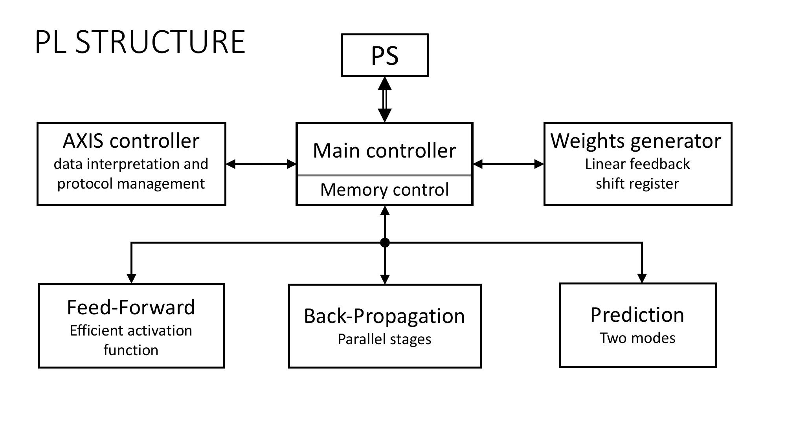

# Hardware Neural Network

This is an embedded hardware accelerator for a Multilayer Perceptron Neural Network for data classification, running on a Xilinx Zynq-7000 System on Chip (SoC), combining a dual-core ARM Cortex-A9 processing system (PS) and a Xilinx programmable logic (PL).

## Scope

Machine learning tends to be found in more and more embedded applications, leading to an increased need for highly efficient computing platforms that are able to process huge amounts of data. As standard CPUs are very flexible and polyvalent, their performances for data-oriented tasks are not satisfactory. Programmable systems, such as FPGAs, solve this problem by allowing the development of highly specific, and thus optimised, solutions.

We present here a hardware version of a simple MLP Neural networks (NN), a class of machine learning models that are really popular for their wide range of applications. The implementation includes both training on a given dataset and classification of new data points.

## Overview

The dataset and the computing commands are sent by a computer to the PS via Serial (UART over USB). Theses commands include the expected size of the set, whether prediction (feedforward) or training (backpropagation) should be conducted, as well as the source of the weights: random, given, or already in the on-board memory.
Depending on the instructions, the task is performed either in software (PS) or in hardware (PL). In the latter case, the dataset and instructions are forwarded to the PL via an AXIS communication bus.

	

## Implementations

Several implementations, either standalone or embedded, have been developed. The first ones act as a proof of concept of the high-level algorithm, while the others allow to compare cost and performances of the final software and hardware embedded applications.
More information on these implementations can be found in their respective folders.

### Standalone vectorised software

A Matlab floating-point implementation of the feedforward and back propagation phases was used to validate the high-level algorithms and verify that a decent accuracy was reachable with datasets of different sizes.

### Embedded software

The Matlab implementation was then translated into a C++ code with the help of the [Eigen library](http://eigen.tuxfamily.org/index.php?title=Main_Page), which is similar to the Matlab language. Moreover, Eigen is fully supported by the ARM core and makes the most from the NEON parallel instruction set.

### Standalone integer Matlab code

The abstraction level of C++ is not suitable for hardware description, especially when it comes to data types and arithmetic operations, as floating point and division used in the previous implementations are hardly synthesizable. An arithmetic model simplifying these complex operations and setting the data types, such as the number of bits or the signedness of all the intermediate variables, was thus needed. An intermediate Matlab implementation using of the Fixed-point Toolbox was thus developed to mimic the hardware dataflow.

### Embedded hardware

The final hardware implementation was coded in VHDL, simulated and synthesised using Xilinx Vivado. It consists in several module communicating together, each performing a specific task. 

	

The AXIS communication is handled by the *AXIS controller*, which also interprets the received data and forward it to the appropriate memory unit. The *feed-forward* and *backpropagation* passes correspond to two different dataflows which receive the processing instructions from the *Main controller*. Other modules allow to randomly generate new weights (necessary for the training) or to predict new labels.

Two main implementations are presented, differing from the way the dataset and weights are stored: one uses Block RAM, which is easily available in the PL but slow to access, while while the other uses Distributed RAM, which is really fast but rather limited in quantity. This illustrates the trade-off between cost and performances in embedded hardware systems.

### About the final app

A python script was developed to allow easy communication with the PS and PL as well as to provide a comprehensible interface for the user.

## Progress and results

While the whole system has been developed with the goal of performing hand-written digits recognition with the [MNIST database](http://yann.lecun.com/exdb/mnist/), tests have currently only be performed using a smaller dataset, the [UCI Wine dataset](https://archive.ics.uci.edu/ml/datasets/Wine).

Even if fixed-point Matlab and the software implementations gives good accuracies, it has not for now been possible to obtain coherent results with the hardware implementation. Timing measurements could however be performed, and should accurately reflect the time performances of the final system.

Measurements for the prediction of 1000 examples with 13 features each:

| Implementations	| Time (us)	| Utilisation 	|
| :---:			| :---:		| :---:		|
| C++ 			| 111000		| x			|
| Block RAM		| 3194		| 8%			|
| Distributed RAM	| 168			| 11%			|

This corresponds to a speed up of more than 600% between the C++ and the Distributed RAM implementations.

## What comes next

* Correct the prediction and back propagation outputs.
* Test with the digits recognition dataset.
* Implement stochastic gradient descent for faster training.
* Add regularisation to prevent overfitting.
* Investigate a dynamic learning rate implementation.

## Credits

The project was developed by Asier Goikoetxea Lopez, Simon Heinke and Paul-Edouard Sarlin, all three exchange students at the National University of Singapore.

