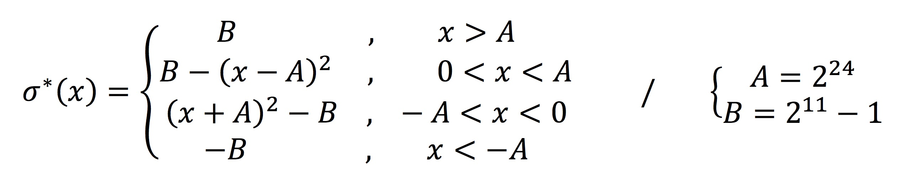

# Standalone software

The code presented here includes implementations used for the development phase as well as the user interface of the final version.

## Vectorised floating-point NN

* `mlp_fmincg.m`: the original Matlab implementation of feedforward and back propagation using the `fmincg` minimisation function (obtained from the [Stanford Machine Learning Coursera MOOC](https://www.coursera.org/learn/machine-learning)).
* `mlp_gdescent.m`: the equivalent code, but this time using the simpler gradient descent algorithm, as a complex minimisation function is hardly implementable in hardware.
* `mlp_eigen_cpp`: the translation of the previous code into a C++ Eigen-based Xcode project.

## Integer math NN

`mlp_integer.m` is an integer-math version of the previous code, used to prototype the hardware dataflow and test its accuracy on various datasets. This Matlab code uses the Fixed-point toolbox to represent and manipulate integer signed and unsigned numbers.

Features, weights as well as intermediate outputs are implemented as 12-bit signed numbers. Other intermediate variables are sized and scaled such that any overflow is avoided and an acceptable precision remains.

As exponentiation and division are two hardly synthesizable operations, a [custom and fast sigmoid function](http://sharpneat.sourceforge.net/research/integer-neuralnet/integer-neuralnet.html) was used. The standard logistic curve is thus replaced by an efficient piecewise square function that only requires a translation, a square and a scaling.

	
	

In the plot are shown the new sigmoid function (red curve) and the scaled standard logistic function (black curve). Both have the same asymptomatic behaviour and only differ a bit in they linear region, which should not affect the performances of the neural network.

## Python interface

A concise python script `serial_interface.py` is used in the final implementation to select the dataset and the task that are to be performed on it: classification or training. Several features are available, such as selecting the origin of the weights or computing the accuracy of the classification using given labels (with `numpy`).
The data is sent and received to the embedded system using `serial` (UART via USB).